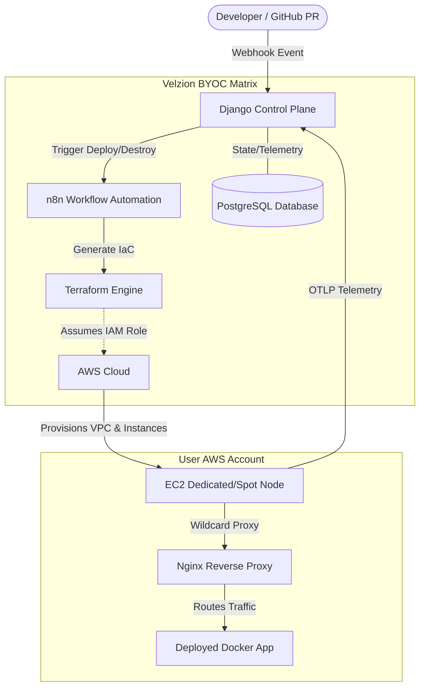

<div align="center">

# 🚀 Project Velzion
**The Open-Source BYOC Control Plane for Automated Deployments & Ephemeral Environments**

<div align="center" style="display: flex; justify-content: center; gap: 10px; flex-wrap: wrap; margin-bottom: 20px;">
  
  
  
  
  
  
  
  
</div>

</div>
Modern cloud development is caught in a paradox: developers crave the flawless, zero-configuration deployment experiences of modern PaaS providers, while startups face brutal pricing markups, lack of deep database isolation, and severe data privacy risks on shared platforms. 

**Velzion resolves this tension.** As an enterprise-grade, open-source Bring Your Own Cloud (BYOC) DevOps Control Plane, Velzion acts strictly as an orchestration brain—it owns zero compute. It turns a company’s private AWS infrastructure into a self-hosted, automated app platform, guaranteeing 100% data residency and zero vendor premium markups.

---

## ✨ Key Features
* 🎛️ **Granular Hardware Control:** Select your exact AWS EC2 Instance Type (e.g., `t3.small`, `c5.large`) and dynamically scale your EBS Storage (10GB - 200GB) directly from the UI before deploying.
* ⚡ **1-Click Ephemeral Environments:** Automatically spin up cheap AWS Spot instances the moment a Pull Request is opened, and auto-destroy them when closed (Zero Idle Cost).
* 📊 **Live OTLP Telemetry:** Stream live CPU and RAM hardware utilization matrices directly from your AWS instances to the React dashboard in real-time.
* ☁️ **Absolute Data Residency:** Since Velzion provisions inside *your* AWS account via temporary STS roles, your databases and application code never touch our servers.
* 🏗️ **Dual-Engine Architecture:** Use **Zegion** for rapid, ephemeral PR previews, and **Velzard** for rock-solid, highly-available production clusters.

---

## 🛑 The Problem

Small to mid-sized engineering teams struggle with two massive operational bottlenecks:
1. **The PaaS Financial Markup Trap:** Hosted platforms charge massive premium markups over raw AWS compute costs, draining early-stage startup capital.
2. **The Persistent Staging Server Waste:** To avoid high bills, teams use a single, shared staging server. This creates massive developer friction: migration conflicts, overwritten branches, blocked QA cycles, and thousands of dollars wasted on idle compute hours.

---

## 🚂 The Solution: Dual-Engine BYOC Architecture

Velzion orchestrates infrastructure directly inside the user's secure AWS environment using a decoupled, event-driven architecture split into two execution pipelines:

* 🏗️ **Velzard (The Production Engine):** For core workloads requiring 24/7 high availability, Velzard automates infrastructure provisioning directly inside the user's AWS account. It configures dedicated EC2 On-Demand resources, Nginx reverse proxy routing, and launches the application via production-hardened configurations.
* 🌪️ **Zegion (The Ephemeral Preview Engine):** Eliminates the single staging server bottleneck entirely. Powered by **n8n** as the automation engine, Zegion listens for GitHub Pull Request events, dynamically boots ultra-cheap AWS Spot instances, compiles code using CNCF Buildpacks, posts a live wildcard preview link to the PR comments, and tears the infrastructure down the second the PR is closed.

---

## 💡 Operational Innovations & FinOps Strategy

* **Two-Tier Zero-Cost Networking:** Tier 1 Terraform provisions a custom VPC with a pure Public Subnet and Internet Gateway. Because it avoids NAT Gateways, idle networking costs exactly **$0.00**. Tier 2 dynamically drops ephemeral Spot instances into this pre-built VPC.
* **Deterministic CNCF Buildpacks:** Zegion utilizes the official CNCF `pack` CLI and `paketobuildpacks/builder-jammy-base` to automatically detect repository language and compile an optimized, OCI-compliant container image—bypassing manual Dockerfiles entirely.
* **Scale-to-Zero Preview Lifecycle:** Ephemeral environments have a strict TTL expiration. When a PR sits idle, n8n auto-destructs the Spot instance and updates its state to `SLEEPING`, guaranteeing a true zero-dollar idle cost profile.
* **ChatOps & Security by Obscurity:** PR links utilize cryptographically hashed wildcard URLs (e.g., `pr-42-x7f9a2p.velzion.dev`). To wake a sleeping PR, developers simply type `/velzion wake` in the GitHub PR comments, and a fresh instance boots automatically within 60 seconds.

---

## 🛠️ Tech Stack

Velzion integrates a diverse set of modern tooling to synthesize application orchestration, infrastructure automation, and continuous delivery into a single platform.

### Control Plane 
* **Backend:** Django, Django REST Framework (DRF), Python
* **Frontend:** React, Vite, Tailwind CSS
* **Database (State):** PostgreSQL
* **Event Broker / Workflow Engine:** n8n (Node-Based Workflow Automation)

### Infrastructure Engine 
* **Infrastructure as Code (IaC):** Terraform, AWS CloudFormation (IAM Trust Delegation)
* **Cloud Provider:** Amazon Web Services (AWS) - VPC, EC2 On-Demand, EC2 Spot Instances, S3 (State Backend)
* **Compute Provisioning:** AWS STS (AssumeRole Credentials), Bash (`user_data.sh`)
* **Compilation:** CNCF Buildpacks (`pack` CLI)

### DevOps & Platform Engineering 
* **Containerization:** Docker, Docker Compose
* **Orchestration:** Kubernetes (Amazon EKS)
* **CI/CD Pipeline:** Jenkins (CI), ArgoCD (GitOps CD), Helm
* **Security & Observability:** Trivy (Vulnerability Scanning), SonarQube (Static Analysis), AWS CloudWatch

### The 1-Click Trust Model (Security)
Velzion **never asks users to input raw AWS Access Keys**. 
For deployment access, the React frontend redirects users to launch a pre-configured CloudFormation stack in their AWS console (with the required IAM policies securely hosted in an S3 bucket). This stack creates an IAM Role that explicitly trusts the central Velzion AWS account. When n8n executes Terraform, it calls AWS STS to assume the role, generating short-lived cryptographic tokens valid only for the deployment duration.


## 🏛️ System Architecture



### Backend Structure & Modular Boundaries
Velzion enforces strict domain boundaries using a **Modular Monolith** architecture built on Django, exposing strict RESTful endpoints.
* `backend/users/`: Handles GitHub OAuth and JWT issuance.
* `backend/velzard/`: Manages the persistent BYOC deployments and IAM state.
* `backend/zegion/`: The ingestion point for GitHub webhooks and TTL logic.

### Database Strategy
Django acts as the central State Machine backed by a single **PostgreSQL** database. Multi-tenancy isolation is enforced logically via tenant foreign keys, tracking repository metadata, VPC IDs, and AWS Role ARNs.

### The 1-Click Trust Model (Security)
Velzion **never asks users to input raw AWS Access Keys**. 
For deployment access, the React frontend redirects users to launch a pre-configured CloudFormation stack in their AWS console. This stack creates an IAM Role that explicitly trusts the central Velzion AWS account. When n8n executes Terraform, it calls AWS STS to assume the role, generating short-lived cryptographic tokens valid only for the deployment duration.

---

## 🐙 Zegion Orchestration Lifecycle

1. Developer opens a PR ➔ GitHub fires a webhook to the Django API.
2. Django writes `PROVISIONING` state to PostgreSQL and forwards the payload to n8n.
3. n8n executes Tier 2 Terraform using STS temporary credentials to boot an AWS EC2 Spot Instance.
4. The instance boots via `user_data.sh`, installs Docker/Git/pack CLI, clones the PR branch, and executes CNCF Buildpack compilation.
5. n8n queries the instance IP, maps the wildcard DNS proxy, and posts the live URL back to the PR comments.

---

## 📁 Repository Structure

Velzion is split across two primary repositories to enforce strict GitOps separation of concerns between Application Code and Infrastructure State.

### 1. Infrastructure Configuration [VELZION](https://github.com/Parth2496Singh/VELZION.git)
```text
velzion/
├── frontend/               # React SPA (Vite, Tailwind)
│   ├── src/pages/          # Velzard & Zegion Dashboards, FinOps, Auth
│   └── nginx.conf          # Reverse proxy configuration
├── backend/                # Django Control Plane
│   ├── core/               # Django Settings & DRF Configuration
│   ├── users/              # GitHub OAuth & User Profiles
│   ├── velzard/            # Production BYOC Engine & API
│   ├── zegion/             # Ephemeral Preview Engine & Webhooks
│   └── terraform/          # IaC configurations (main.tf, velzard_main.tf)
├── workflows/              # Exported n8n JSON pipelines (Zegion & Velzard)
├── docker-compose.yml      # Local development cluster orchestration
└── Jenkinsfile             # CI/CD Pipeline definition
```
### 2. Continuous Delivery [VELZION-GITOPS](https://github.com/Parth2496Singh/VELZION-GITOPS)
```text
velzion-gitops/
├── Chart.yaml              # Helm chart metadata and dependencies
├── gitops/                 # Continuous Delivery Configurations
│   ├── applicationset-velzion.yaml  # ArgoCD ApplicationSet definition
│   └── argocd-notifications-cm.yaml # Slack/Email deployment alerts
├── templates/              # Kubernetes Manifests (Helm Templates)
│   ├── backend-deployment.yaml      # Django control plane pods
│   ├── db-statefulset.yaml          # PostgreSQL persistent volume claims
│   ├── frontend-deployment.yaml     # React frontend pods
│   ├── ingress.yaml                 # Nginx ingress routing rules
│   ├── n8n-deployment.yaml          # n8n automation engine pods
│   └── services.yaml                # Internal cluster networking
└── values.yaml             # Environment-specific variable overrides
```
## 👶 Beginner's Guide: Step-by-Step Installation

We've made deploying Velzion as simple as possible. Whether you're running it on your laptop or a cloud server, follow these exact steps.

<details>
<summary><h3>💻 Option 1: Local Setup (For Development on your Laptop)</h3></summary>

**Step 1: Clone the Project**
Open your terminal and download the code:
```bash
git clone https://github.com/Parth2496Singh/VELZION.git
cd VELZION
```

**Step 2: Set up the Environment Variables**
We need to give the app its passwords. We have provided a template for you:
```bash
cp .env.example .env
```
Open the `.env` file in your code editor. 
- You don't need to change `DJANGO_SECRET_KEY` or `N8N_WEBHOOK_SECRET` for local use.
- **Database:** Go to [Supabase](https://supabase.com/) or [Neon](https://neon.tech/), create a free Postgres database, and paste the credentials into the `DATABASE_URL` and `DB_POSTGRESDB_*` fields.
- **GitHub:** Go to GitHub -> Settings -> Developer Settings -> OAuth Apps. Create one with Homepage `http://localhost:5173` and Callback `http://localhost:5173/auth/callback`. Paste the Client ID and Secret into your `.env`. Create a Personal Access Token and paste it into `GITHUB_PAT`.

**Step 3: Run the Application!**
Make sure Docker is installed and running on your computer, then run:
```bash
docker-compose up --build
```
*Wait a few minutes for everything to download and start.*

**Step 4: Access Velzion**
- 🌐 Frontend Dashboard: `http://localhost:5173`
- ⚙️ Backend API: `http://localhost:8000`
- 🤖 n8n Automations: `http://localhost:5678`

</details>

<details>
<summary><h3>☁️ Option 2: EC2 Production Setup (For Live Cloud Servers)</h3></summary>

**Step 1: Connect to your EC2 Server**
SSH into your AWS EC2 instance (Ubuntu recommended):
```bash
ssh -i your-key.pem ubuntu@your-ec2-ip
```

**Step 2: Install Docker and Git**
If it's a brand new server, install the required tools:
```bash
sudo apt update
sudo apt install -y git docker.io docker-compose
sudo usermod -aG docker ubuntu
# Log out and log back in for docker groups to apply
```

**Step 3: Clone the Project**
Download the code to your server:
```bash
git clone https://github.com/Parth2496Singh/VELZION.git
cd VELZION
```

**Step 4: Set up the Production Environment Variables**
```bash
cp .env.example .env
nano .env
```
Now fill in your `.env` file:
- **Change** `DJANGO_SECRET_KEY` and `N8N_WEBHOOK_SECRET` to random, secure passwords!
- **Database:** Paste your external Supabase/Neon PostgreSQL credentials.
- **GitHub:** Create a GitHub OAuth App with your EC2's Public IP (e.g., `http://54.12.34.56` and `http://54.12.34.56/auth/callback`) and paste the IDs. Paste your `GITHUB_PAT`.
- **AWS Credentials:** Fill in `AWS_ACCESS_KEY_ID` and `AWS_SECRET_ACCESS_KEY` so Velzion can provision infrastructure.
- **Frontend URLs:** Change `VITE_API_BASE_URL` and `VITE_N8N_WEBHOOK_URL` to your EC2's public IP (e.g., `http://54.12.34.56:8000`).
- Press `CTRL+X`, then `Y`, then `Enter` to save and exit nano.

**Step 5: Run the Production Build!**
We use a special command for EC2 that builds an optimized, lightning-fast Nginx version of the app:
```bash
docker-compose -f docker-compose.prod.yml up -d --build
```
*(The `-d` flag runs it in the background so it stays alive when you close your SSH terminal).*

**Step 6: Access Velzion**
Open your web browser and go to your EC2's Public IP address! (e.g., `http://54.12.34.56`)

</details>

---

## ☸️ Control Plane Infrastructure & CI/CD (EKS GitOps)
The core Velzion Control Plane operates as a cloud-native application deployed to Amazon EKS. Local development utilizes Docker Compose to orchestrate the monolith seamlessly.

**Continuous Integration**: Jenkins (Jenkinsfile) drives the DevSecOps pipeline, running SonarQube for static analysis and Trivy for container vulnerability scanning.

**Continuous Delivery**: Executed via ArgoCD monitoring the velzion-gitops repository. It pulls Helm manifested configurations directly into the EKS cluster via a strict GitOps model.

**State Management**: Terraform execution states are securely bound to an AWS S3 remote backend to protect against pod restarts.

**Observability**: System logs and container metrics are piped to AWS CloudWatch.

---

## 🐳 Docker Image Build & Push Guide (SemVer Versioning)

If you are deploying Velzion to a Kubernetes cluster or a remote EC2 machine, you will want to build and push your Docker images to a container registry (like Docker Hub or AWS ECR) using Semantic Versioning (SemVer).

### 1. Tagging Strategy
Always tag your images with a specific semantic version (e.g., `v1.2.0`) rather than relying purely on `latest`. This ensures repeatable, rollback-safe deployments.

### 2. Building & Pushing the Backend & n8n
These are standard builds that inject the code into the image:

```bash
# Build and tag the images
docker build -t your-registry/velzion-backend:v1.2.0 ./backend
docker build -t your-registry/velzion-n8n:v1.2.0 -f ./backend/n8n.Dockerfile ./backend

# Push the images to your registry
docker push your-registry/velzion-backend:v1.2.0
docker push your-registry/velzion-n8n:v1.2.0
```

### 3. Building & Pushing the Frontend (Important: Build Args)
Unlike the backend, the React frontend is compiled into static files *during* the Docker build process. It needs to know the production URLs at compile time. You **must** pass these via `--build-arg`:

```bash
# Define your production EC2/Domain IPs
export PROD_API_URL="http://your-production-domain.com/api"
export PROD_WEBHOOK_URL="http://your-production-domain.com/webhook"

# Build the frontend with arguments injected
docker build \
  --build-arg VITE_API_BASE_URL=$PROD_API_URL \
  --build-arg VITE_N8N_WEBHOOK_URL=$PROD_WEBHOOK_URL \
  -t your-registry/velzion-frontend:v1.2.0 \
  ./frontend

# Push the frontend image
docker push your-registry/velzion-frontend:v1.2.0
```

### 4. Updating your `docker-compose.prod.yml`
Once pushed, you can update your EC2 machine to simply pull the images instead of building from source! Replace `build:` with `image: your-registry/velzion-frontend:v1.2.0` in your production compose file.

## 📄 License
This project is licensed under the MIT License - see the LICENSE file for details.
